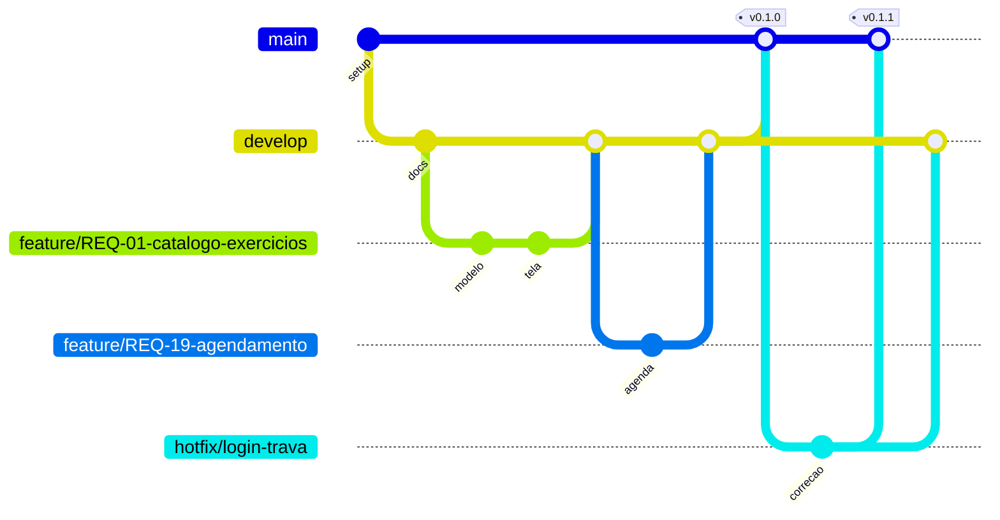

# GitFlow Simplificado — Academia Grazy (Grupo 6)

Este documento define **como o código anda** neste repositório. Vale para todos
os integrantes do grupo. Em caso de dúvida, siga o que está aqui.

---

## 1. Por que "simplificado"

O GitFlow original tem cinco tipos de branch (`main`, `develop`, `feature`,
`release`, `hotfix`). Para um projeto acadêmico de um semestre, `release` cria
mais burocracia do que valor: a entrega é marcada por **tag** direto na `main`.

Ficamos com **quatro**:

| Branch | Vive para sempre? | Sai de | Volta para | Para quê |
|---|---|---|---|---|
| `main` | Sim | — | — | Código estável, sempre apresentável |
| `develop` | Sim | `main` | `main` (na entrega) | Integração de todo mundo |
| `feature/*` | Não | `develop` | `develop` | Uma funcionalidade / requisito |
| `hotfix/*` | Não | `main` | `main` + `develop` | Bug urgente no que já foi entregue |

**Regra de ouro:** ninguém comita direto em `main` nem em `develop`.
Todo código entra por **Pull Request**.

---

## 2. O fluxo em um diagrama



Lendo de cima para baixo: o trabalho nasce em `develop`, cada pessoa abre a sua
`feature/*`, devolve para `develop` via PR, e quando o conjunto está apresentável
`develop` sobe para `main` com uma tag de versão.

---

## 3. Nomes de branch

Formato: `tipo/REQ-XX-descricao-curta`

- tudo em **minúsculo**, palavras separadas por hífen
- sem acento, sem espaço, sem `ç`
- cite o requisito quando existir — facilita rastrear (REQ-08 pede rastreabilidade)

| Tipo | Quando usar | Exemplo |
|---|---|---|
| `feature/` | Funcionalidade nova | `feature/REQ-03-ficha-treino-personalizada` |
| `fix/` | Bug encontrado durante o desenvolvimento, em `develop` | `fix/REQ-13-calculo-imc-arredondamento` |
| `hotfix/` | Bug urgente no que já está em `main` | `hotfix/crash-login-android` |
| `docs/` | Só documentação | `docs/manual-instalacao` |
| `chore/` | Configuração, dependências, CI | `chore/atualiza-flutter-3-27` |

Sem requisito associado, descreva o assunto: `feature/tela-splash`.

---

## 4. Padrão de mensagem de commit

Usamos **Conventional Commits** — curto, em português, no imperativo.

```
tipo(escopo): descrição no imperativo

Corpo opcional explicando o porquê da mudança.

Refs: REQ-XX
```

Tipos aceitos: `feat`, `fix`, `docs`, `style`, `refactor`, `test`, `chore`.

Bons exemplos:

```
feat(treinos): adiciona catálogo de exercícios por grupo muscular

Refs: REQ-01
```

```
fix(avaliacao): corrige cálculo de IMC para altura em centímetros

Refs: REQ-13
```

```
docs(gitflow): descreve o fluxo de hotfix
```

Evite: `atualizações`, `commit`, `teste`, `ajustes finais`, `.`

**Uma mudança lógica por commit.** É melhor cinco commits pequenos e claros do
que um commit gigante chamado "tudo".

---

## 5. Ciclo de uma feature (o caso de 90% dos dias)

```bash
# 1. Vá para develop e pegue o que os outros já enviaram
git checkout develop
git pull origin develop

# 2. Crie sua branch
git checkout -b feature/REQ-03-ficha-treino-personalizada

# 3. Trabalhe e comite quantas vezes precisar
git add .
git commit -m "feat(treinos): cria modelo de ficha de treino"

# 4. Antes de enviar, traga as novidades de develop para a sua branch
git checkout develop
git pull origin develop
git checkout feature/REQ-03-ficha-treino-personalizada
git merge develop        # resolva conflitos aqui, na SUA branch

# 5. Envie e abra o Pull Request
git push -u origin feature/REQ-03-ficha-treino-personalizada
```

No GitHub: **Compare & pull request** → base `develop` ← compare
`feature/REQ-03-...` → preencha o template → peça revisão a um colega.

Depois do merge aprovado:

```bash
git checkout develop
git pull origin develop
git branch -d feature/REQ-03-ficha-treino-personalizada          # apaga local
git push origin --delete feature/REQ-03-ficha-treino-personalizada  # apaga remota
```

---

## 6. Ciclo de um hotfix

Só quando algo quebrado já está em `main`.

```bash
git checkout main
git pull origin main
git checkout -b hotfix/crash-login-android

# corrige e comita
git commit -m "fix(auth): trata token nulo no login Android"

git push -u origin hotfix/crash-login-android
```

Abra **dois** Pull Requests: um para `main` e outro para `develop`. Se o hotfix
só voltar para `main`, o bug reaparece na próxima entrega.

Depois do merge em `main`, marque a versão:

```bash
git checkout main
git pull origin main
git tag -a v0.1.1 -m "Corrige crash no login Android"
git push origin v0.1.1
```

---

## 7. Entrega: subindo `develop` para `main`

Ao fechar um marco (apresentação, sprint, entrega parcial):

1. Confirme que `develop` está funcionando — o app roda, nada quebrado.
2. Abra um Pull Request de `develop` → `main`, com o resumo do que entrou.
3. Após o merge, crie a tag da versão:

```bash
git checkout main
git pull origin main
git tag -a v0.1.0 -m "Entrega 1: módulo de treinos"
git push origin v0.1.0
```

Versionamento: `vMAJOR.MINOR.PATCH`
`v0.1.0` primeira entrega · `v0.2.0` novas funcionalidades · `v0.1.1` só correções.

---

## 8. Regras do grupo

1. **Nunca** `git push --force` em `main` ou `develop`. Reescrever histórico compartilhado quebra o repositório de todos.
2. **Nunca** comite direto em `main` ou `develop` — sempre por PR.
3. Todo PR precisa de **pelo menos 1 aprovação** de outro integrante.
4. Faça `git pull origin develop` **antes** de começar a trabalhar, todo dia.
5. Branch parada por mais de uma semana vira conflito. Prefira entregas pequenas.
6. Conflito se resolve **na sua branch**, nunca na `develop`.
7. Nada de segredo versionado: `.env`, chaves, credenciais de pagamento, dados reais de aluno.
8. Se ficou na dúvida sobre um merge, **pergunte antes** de executar.

---

## 9. Proteção de branch no GitHub (configurar uma vez)

Em **Settings → Branches → Add branch protection rule**, para `main` e `develop`:

- [x] Require a pull request before merging
- [x] Require approvals — 1
- [x] Do not allow bypassing the above settings
- [ ] Allow force pushes — deixe **desmarcado**

Isso transforma as regras acima em algo que o GitHub cobra sozinho.

---

## 10. Colando os pedaços: quem faz o quê

Sugestão de divisão por módulo, uma pessoa (ou dupla) por frente:

| Frente | Requisitos | Branch inicial |
|---|---|---|
| Treinos | REQ-01 a REQ-11 | `feature/REQ-01-catalogo-exercicios` |
| Avaliação física | REQ-12 a REQ-18 | `feature/REQ-12-medidas-corporais` |
| Agendamento | REQ-19 a REQ-22 | `feature/REQ-19-agendamento-aulas` |
| Financeiro | REQ-23 a REQ-26 | `feature/REQ-23-registro-cobrancas` |
| Administrativo | REQ-27 a REQ-31 | `feature/REQ-27-dashboard-produtividade` |

Como o escopo prioriza treinos, comece por lá e mantenha as outras frentes em
branches curtas para não acumular conflito.
